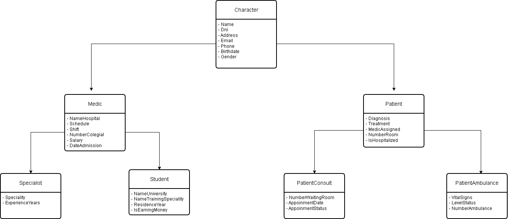

# The Hospital Exercise in Java


## Description
A hospital exercise system created by Java language where we practise object-oriented programming (OOP) and SOLID principles.

The objective is to have a a modular design and scalable in a future.

This system allows us to modelate different types of characters:
- **Students**
-  **Specialists**
-  **Ambulance Pacients**
-  **Consultant Pacients**

## Model of Clases
### Class Character
This class is the high super clase of the excercise.

It can be represented by any character of the hospital

#### Atributtes of Character
- **Name**
- **Dni**
- **Address**
- **Email**
- **Phone**
- **Birthdate**
- **Gender**

### Class Medic and Class Patient
Both class inherit from the class Character.
It represented by medics and patients at the hospital.

#### Atributtes of Medic
- **Schedule**
- **Shift**
- **Name Hospital**
- **NumberCollegial**
- **Salary**
- **Date Admission**

#### Atributtes of Patients
- **Diagnosis**
- **Treatment**
- **Medic Assigned**
- **NumberRoom**
- **Salary**
- **Is Hospitalized**

## Class Specialist and Student
Both class inherit from the class Medic.


#### Atributtes of Students
- **Name University**
- **Name Training**
- **Residence Year**
- **Is Earning Money**

#### Atributtes of Specialists
- **Speciality**
- **Experience Years**

## Solid Principles
### Single Responsability Principle
Each class have unique responsability
- **Character**: Personal data (basic)
- **Medic**: Profesional medic data
- **Patient**: Clinic patient data
- **Actions**: Operations logic interfaces

### Open/Closed Principle
The system allows new types to be added without modifying the existing code.
### Liskov Substitution Principle
Child classes can replace their parent classes.
### Interface Segregation Principle
The functionalities are separated into different classes of actions to avoid overly large classes.
### Dependency Inversion Principle
The logic of the system is organised in layers to allow future dependencies on abstractions rather than concrete implementations.

## Run Excercise
```
1. Git clone https://github.com/AlbertoDeveloper94/TheHospitalJava.git
2. Open editor **IntelliJ Idea**
3. Run class Main.
```

## Structure of Excercise
```
org.example
│
├── character
│   │
│   ├── Character.java
│   ├── Medic.java
│   ├── Patient.java
│   │
│   ├── medics
│   │   ├── Specialist.java
│   │   └── Student.java
│   │
│   ├── patients
│   │   ├── PatientAmbulance.java
│   │   └── PatientConsult.java
│   │
│   └── characters
│       └── actions
│           │
│           ├── medics
│           │   ├── AllMedics.java
│           │   ├── Specialists.java
│           │   └── Students.java
│           │
│           └── patients
│               ├── AllPatients.java
│               ├── PatientsAmbulance.java
│               └── PatientsConsult.java
│
├── Main.java
│
└── resources
```
